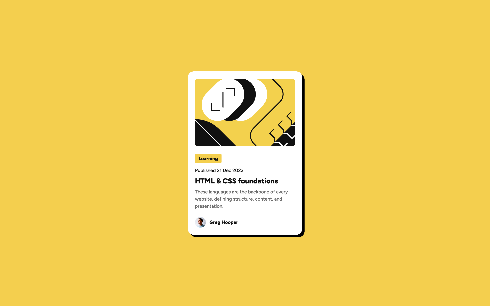

# Frontend Mentor - Blog preview card solution

This is a solution to the [Blog preview card challenge on Frontend Mentor](https://www.frontendmentor.io/challenges/blog-preview-card-ckPaj01IcS). Frontend Mentor challenges help you improve your coding skills by building realistic projects.

## Table of contents

- [Overview](#overview)
  - [The challenge](#the-challenge)
  - [Screenshot](#screenshot)
  - [Links](#links)
- [My process](#my-process)
  - [Built with](#built-with)
  - [What I learned](#what-i-learned)
  - [Continued development](#continued-development)
  - [Useful resources](#useful-resources)
- [Author](#author)

## Overview

### The challenge

Users should be able to:

- See hover and focus states for all interactive elements on the page

### Screenshot



### Links

- Live URL: [https://madewithbill.github.io/fm-blog-preview-card/](https://madewithbill.github.io/fm-blog-preview-card/)

## My process

### Built with

- Semantic HTML5 markup
- CSS custom properties
- Flexbox
- Child and descendant combinators to minimize class/id creation

### What I learned

This was a good chance to reinforce my use of custom properties according to a provided design, bringing that design system into practice in a more effienct way than hardcoding values throughout the stylesheet.

I've also been utilizing combinators a lot more to avoid creating unneccessary indentifiers in the HTML markup.

```css
article > img {
  display: block;
  width: 100%;
  border-radius: 0.625rem;
  overflow: hidden;
  object-fit: cover;
}

article p,
article h3 {
  margin: 0;
}
```

Small detail, but `margin-block` is recent find for me, and I'm way more excited about using it than a normal persona should be. Just so much easier and intuitive than adding margin-bottom to several elements.

```css
div.card-detail {
  display: flex;
  flex-direction: column;
  align-items: start;
  gap: var(--spacing-150);
  margin-block: var(--spacing-300);
}
```

### Continued development

I'd like to get more comfortable with quickly identify and implementing semantic HTML structures. The essentials like `nav`, `header`, `main`, etc. are fairly straightforward, but I definitely want to be able to recognize card elements like this and clearly maximize the meaning behind every element.

Also, effectively implementing design systems in a production enviroment is something I want to continue expanding upon.

### Useful resources

- [Stack Overflow: Why does my image inside a div have extra space below it?](https://stackoverflow.com/questions/5804256/why-does-my-image-inside-a-div-have-extra-space-below-it) - Ended up here while troubleshooting the empty space below the card's main image. A good reminder that image elements are inline by default, and I should probably embrace a style reset on images going forward.

## Author

- Portfolio - [madewithbill](https://www.madewithbill.com/)
